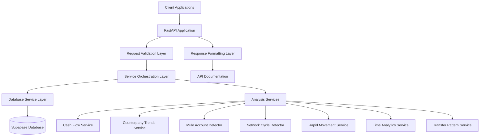

# Design Document

## Overview

This design outlines the integration of existing financial analysis services into a unified FastAPI web service. The system will expose the current analytical capabilities through RESTful endpoints while maintaining the existing functionality and adding proper error handling, validation, and documentation.

The current system consists of specialized analysis modules for financial transaction analysis, including cash flow analysis, counterparty trend analysis, mule account detection, network cycle detection, rapid movement detection, round trip analysis, time-based analytics, and transfer pattern analysis. These services will be wrapped in a FastAPI application with standardized request/response formats.

## Architecture

### High-Level Architecture



### Technology Stack

- **Web Framework**: FastAPI (Python 3.11+)
- **Database**: Supabase (PostgreSQL)
- **Data Processing**: Polars (existing dependency)
- **Validation**: Pydantic models
- **Documentation**: OpenAPI/Swagger (built-in FastAPI)
- **Error Handling**: Custom exception handlers
- **Monitoring**: Prometheus metrics endpoint

### Design Rationale

1. **FastAPI Selection**: Chosen for automatic OpenAPI documentation, built-in validation, async support, and excellent performance
2. **Service Wrapper Pattern**: Existing analysis services will be wrapped rather than rewritten to preserve functionality
3. **Database Abstraction**: Database operations will be centralized in a service layer for maintainability
4. **Standardized Response Format**: All endpoints will return consistent JSON structures

## Components and Interfaces

### 1. FastAPI Application Structure

```
app/
├── main.py                 # FastAPI application entry point
├── api/
│   ├── __init__.py
│   ├── v1/
│   │   ├── __init__.py
│   │   ├── router.py       # Main API router
│   │   └── endpoints/
│   │       ├── __init__.py
│   │       ├── health.py   # Health check endpoint
│   │       └── analysis.py # Analysis endpoints
├── core/
│   ├── __init__.py
│   ├── config.py          # Configuration management
│   ├── database.py        # Database connection
│   └── exceptions.py      # Custom exceptions
├── models/
│   ├── __init__.py
│   ├── requests.py        # Request models
│   └── responses.py       # Response models
├── services/
│   ├── __init__.py
│   ├── database_service.py # Database operations
│   └── analysis_service.py # Analysis orchestration
└── utils/
    ├── __init__.py
    └── validators.py      # Custom validators
```

### 2. Request/Response Models

#### Base Request Model

```python
class AnalysisRequest(BaseModel):
    entity_ids: List[str] = Field(..., min_items=1, max_items=50)
    date_from: Optional[datetime] = None
    date_to: Optional[datetime] = None

    class Config:
        json_encoders = {
            datetime: lambda v: v.isoformat()
        }
```

#### Base Response Model

```python
class AnalysisResponse(BaseModel):
    success: bool
    message: str
    data: Optional[Dict[str, Any]] = None
    metadata: Optional[Dict[str, Any]] = None
    timestamp: datetime = Field(default_factory=datetime.utcnow)
```

#### Error Response Model

```python
class ErrorResponse(BaseModel):
    success: bool = False
    error_code: str
    message: str
    details: Optional[Dict[str, Any]] = None
    timestamp: datetime = Field(default_factory=datetime.utcnow)
```

### 3. Database Service Layer

The database service will handle all Supabase interactions:

```python
class DatabaseService:
    async def get_entity_transactions(self, entity_ids: List[str],
                                    date_from: Optional[datetime] = None,
                                    date_to: Optional[datetime] = None) -> pd.DataFrame

    async def validate_entity_exists(self, entity_id: str) -> bool

    async def get_entity_metadata(self, entity_ids: List[str]) -> Dict[str, Any]
```

### 4. Analysis Service Orchestration

The analysis service will coordinate between database operations and existing analysis modules:

```python
class AnalysisService:
    def __init__(self, db_service: DatabaseService):
        self.db_service = db_service

    async def analyze_cash_flow(self, entity_ids: List[str], **kwargs) -> Dict[str, Any]
    async def analyze_counterparty_trends(self, entity_ids: List[str], **kwargs) -> Dict[str, Any]
    async def detect_mule_accounts(self, entity_ids: List[str], **kwargs) -> Dict[str, Any]
    async def detect_cycles(self, entity_ids: List[str], **kwargs) -> Dict[str, Any]
    async def analyze_rapid_movements(self, entity_ids: List[str], **kwargs) -> Dict[str, Any]
    async def analyze_time_trends(self, entity_ids: List[str], **kwargs) -> Dict[str, Any]
    async def analyze_transfer_patterns(self, entity_ids: List[str], **kwargs) -> Dict[str, Any]
```

### 5. API Endpoints Design

#### Health Check Endpoint

- **GET** `/health`
- Returns service status, database connectivity, and system metrics

#### Analysis Endpoints

All analysis endpoints follow the pattern:

- **POST** `/api/v1/analyze/{analysis_type}`
- Accept JSON request body with entity IDs and optional parameters
- Return standardized JSON response with analysis results

**Endpoint Mapping:**

- `/api/v1/analyze/cash-flow` → Cash Flow Analysis
- `/api/v1/analyze/counterparty-trends` → Counterparty Trend Analysis
- `/api/v1/analyze/mule-accounts` → Mule Account Detection
- `/api/v1/analyze/cycles` → Network Cycle Detection (single entity) / Round Trip Detection (multiple entities)
- `/api/v1/analyze/rapid-movements` → Rapid Movement Analysis
- `/api/v1/analyze/time-trends` → Time-based Analytics
- `/api/v1/analyze/transfer-patterns` → Transfer Pattern Analysis

## Data Models

### Database Schema Integration

The API will integrate with the existing Supabase schema:

- **entities**: Core entity information (PAN, name, type, etc.)
- **accounts**: Bank account details linked to entities
- **transactions**: Individual transaction records
- **cases**: Investigation case management
- **case_entities**: Entity-case relationships

### Transaction Data Flow

1. **Request Validation**: Pydantic models validate incoming requests
2. **Entity Validation**: Verify entity IDs exist in database
3. **Data Retrieval**: Fetch transaction data for specified entities and date range
4. **Data Transformation**: Convert database results to Polars DataFrame format
5. **Analysis Execution**: Pass data to appropriate analysis service
6. **Result Formatting**: Transform analysis results to standardized response format
7. **Response Delivery**: Return JSON response with analysis results

### Analysis Result Standardization

Each analysis service will return results in a consistent format:

```python
{
    "analysis_type": "cash_flow",
    "entity_count": 1,
    "transaction_count": 150,
    "date_range": {
        "from": "2024-01-01T00:00:00Z",
        "to": "2024-12-31T23:59:59Z"
    },
    "results": {
        # Service-specific analysis results
    },
    "insights": [
        # Generated insights and recommendations
    ],
    "risk_indicators": [
        # Risk flags and alerts
    ]
}
```

## Error Handling

### Exception Hierarchy

```python
class APIException(Exception):
    """Base API exception"""

class ValidationError(APIException):
    """Request validation errors"""

class EntityNotFoundError(APIException):
    """Entity does not exist"""

class DatabaseError(APIException):
    """Database connection/query errors"""

class AnalysisError(APIException):
    """Analysis processing errors"""

class ServiceUnavailableError(APIException):
    """Service temporarily unavailable"""
```

### Error Response Strategy

- **422 Unprocessable Entity**: Validation errors with detailed field-level messages
- **404 Not Found**: Entity not found or invalid endpoints
- **500 Internal Server Error**: Analysis processing errors (logged but not exposed)
- **503 Service Unavailable**: Database connectivity issues

### Error Logging

All errors will be logged with:

- Request ID for tracing
- User context (if available)
- Full stack trace for debugging
- Sanitized error details for client response

## Testing Strategy

### Unit Testing

- **Service Layer**: Mock database calls, test analysis logic
- **API Endpoints**: Test request/response handling
- **Validation**: Test Pydantic model validation
- **Error Handling**: Test exception scenarios

### Integration Testing

- **Database Integration**: Test with real Supabase connection
- **End-to-End**: Test complete request flow
- **Performance**: Load testing for concurrent requests

### Test Data Strategy

- Use anonymized transaction data for testing
- Create test fixtures for different analysis scenarios
- Mock external dependencies for isolated testing

### Testing Framework

- **pytest**: Primary testing framework
- **httpx**: Async HTTP client for API testing
- **pytest-asyncio**: Async test support
- **factory_boy**: Test data generation

## Security Considerations

### Input Validation

- Strict validation of entity IDs (UUID format)
- Date range validation and limits
- Request size limits to prevent DoS
- SQL injection prevention through parameterized queries

### Data Protection

- No sensitive data in logs
- Sanitized error messages
- Rate limiting on API endpoints
- Request/response size limits

### Authentication & Authorization

- Placeholder for future authentication integration
- Role-based access control preparation
- API key validation framework

## Performance Optimization

### Database Optimization

- Connection pooling for Supabase
- Query optimization with proper indexing
- Pagination for large result sets
- Caching for frequently accessed entity metadata

### Analysis Performance

- Async processing for independent analyses
- Memory-efficient data processing with Polars
- Result caching for expensive computations
- Background task processing for long-running analyses

### API Performance

- Response compression
- Async request handling
- Connection keep-alive
- Monitoring and metrics collection

## Monitoring and Observability

### Health Checks

- Database connectivity check
- Service dependency health
- System resource monitoring
- Custom health indicators

### Metrics Collection

- Request/response metrics
- Analysis execution times
- Error rates and types
- Database query performance

### Logging Strategy

- Structured logging (JSON format)
- Request tracing with correlation IDs
- Performance logging
- Error tracking and alerting

## Deployment Considerations

### Environment Configuration

- Environment-specific settings
- Database connection strings
- Feature flags for analysis modules
- Monitoring and logging configuration

### Scalability

- Horizontal scaling capability
- Load balancing considerations
- Database connection management
- Resource usage optimization

### Dependencies

- Python 3.11+ runtime
- FastAPI and dependencies
- Polars for data processing
- Supabase client libraries
- Monitoring and logging libraries
